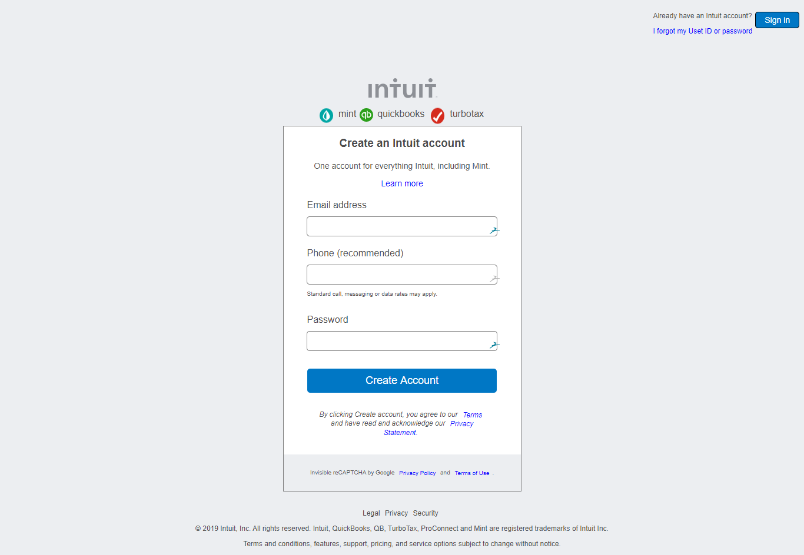

# HTML-Forms
## Description:
A project to create a replica of mint.com's sign up page
## Motivation:
 We built this project in order to solidify our knowledge of HTML forms and CSS structures.

#### [Assignment Link](https://www.theodinproject.com/courses/html5-and-css3/lessons/html-forms)

#### [Project Live Version](https://audrey-ella-xo.github.io/HTML-Forms/)

#### Screenshot

#### Contributors:
 * [Ramesh Naidu](https://github.com/rna)
 * [Odiaka Emmanuella Anita](https://github.com/Audrey-Ella-xo)
